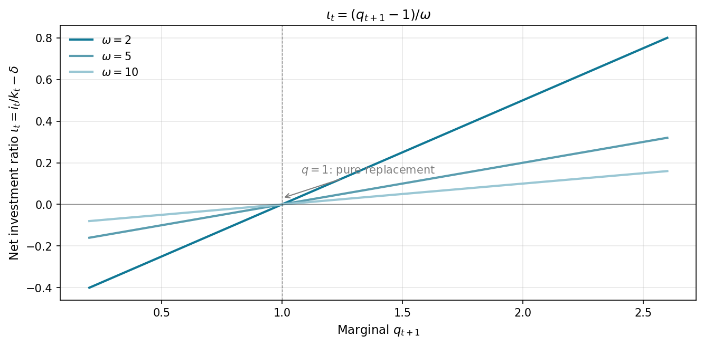
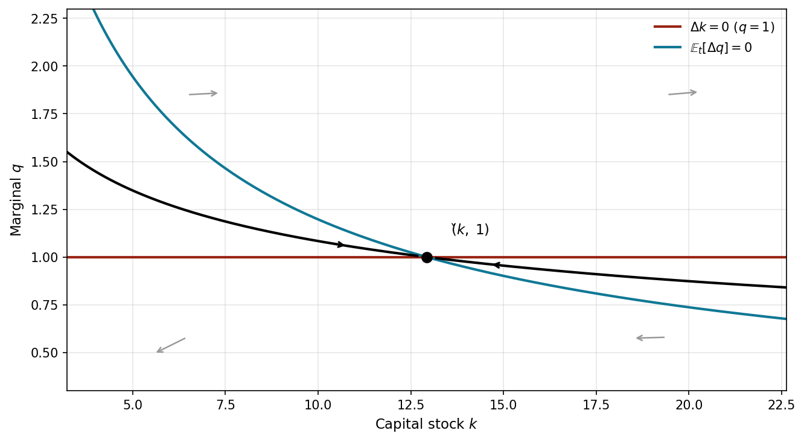
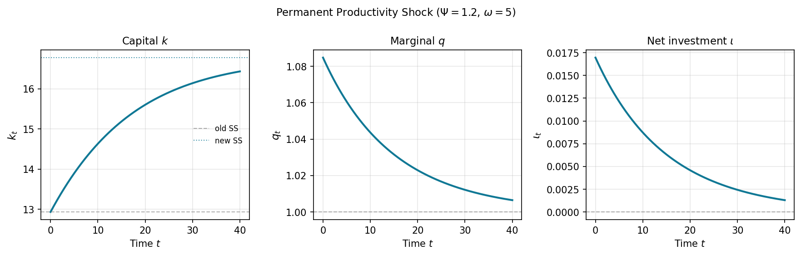

# Why Study Investment?

## Investment Drives the Business Cycle

Business investment is small relative to GDP (roughly 15 percent in the United States) but it is exceptionally volatile. When GDP contracts, investment collapses far more than consumption does. As a result, swings in investment account for a *disproportionately large* share of business-cycle variation in output.

Two reasons make investment central to macroeconomics:

1. **Short run:** Fluctuations in investment are the main proximate source of aggregate demand shocks.
2. **Long run:** The average level of investment determines the capital stock, which in turn determines productivity and living standards.

## A Brief History of Thought

| Era | Model | Key feature |
|-----|-------|-------------|
| Keynes (1936) | Animal spirits | Investment driven by irrational swings in confidence |
| Samuelson/Hansen | Multiplier-accelerator | $I_t = \alpha Y_t - \gamma r_t$; investment responds to output and rates |
| Hall-Jorgenson (1967) | Neoclassical | Firm optimizes; capital adjusts instantly to fundamentals |
| Tobin (1969) | Average $Q$ | Stock-market value relative to replacement cost guides investment |
| Abel (1982), Hayashi (1982) | Marginal $q$ | Dynamic optimization with convex adjustment costs |
| Fazzari et al. (1988) | Imperfect capital markets | Internal funds matter; Modigliani-Miller fails |

The course follows this progression, adding each ingredient in turn.

## The Samuelson Model: Why It Falls Short

The multiplier-accelerator model reduces investment to a linear function of output and interest rates:

$$I_t = \alpha Y_t - \gamma r_t$$

In purely statistical terms, this fits the data well. Output rises, investment rises; rates rise, investment falls. The difficulty: $Y_t$, $r_t$, and $I_t$ are jointly determined by deeper forces. The equation summarizes a pattern in the data rather than explaining what drives investment.

::: {.notes}
Hall and Jorgenson's improvement is to derive the desired capital stock from an optimizing firm. The firm's production function, the depreciation rate, and tax parameters together determine the capital target and, from there, investment spending.
:::

# The Hall-Jorgenson Model

## The Firm's Static Problem

Hall and Jorgenson consider a firm whose output depends only on its capital stock $k_t$:

$$y_t = f(k_t) = k_t^\alpha$$

The firm rents capital from the market at cost $c_k$ per unit. The profit-maximization problem is

$$\max_{k_t} \; k_t^\alpha - c_k k_t$$

## The Optimal Capital Stock

The first-order condition pins down the optimal capital stock:

$$\boxed{f'(k_t) = c_k \quad \Longrightarrow \quad k_t = \alpha \, y_t / c_k}$$

The firm hires capital up to the point where its marginal product equals the rental rate. The capital stock is always at the static optimum: there are no adjustment costs and no dynamics.

## No-Arbitrage and the Cost of Capital

No-arbitrage between deposits at rate $r$ and physical capital (price $p_k$, depreciation $\delta$) gives

$$r \, p_k = c_k - \delta \, p_k + \dot{p}_k$$

Assuming constant capital prices ($\dot{p}_k = 0$), the rental rate satisfies

$$c_k = (r + \delta) \, p_k$$

The cost of capital equals the **interest cost** plus the **replacement cost** of depreciated capital.

::: {.notes}
An investor placing one dollar in the bank earns $r$. An investor who instead buys a unit of capital earns rental income $c_k$, collects capital gains $\dot{p}_k$, but suffers depreciation $\delta p_k$. Indifference between the two yields the no-arbitrage equation.
:::

## Tax Parameters

Two tax parameters modify the cost of capital:

- $\tau$: corporate tax rate on earnings
- $\xi$: investment tax credit (ITC), so the after-tax price of a unit of capital is $(1-\xi)p_k$

After-tax arbitrage requires

$$(r + \delta)(1-\xi)p_k = (1-\tau)\, c_k$$

## The Effective Cost of Capital

Solving the arbitrage condition gives the **effective cost of capital**:

$$\boxed{c_k = \frac{(r + \delta)(1-\xi)}{1-\tau} \, p_k}$$

An increase in $\xi$ (more generous ITC) lowers the effective cost. An increase in $\tau$ (higher corporate taxes) raises it.

## Gross Investment

The Hall-Jorgenson model is a theory of the *level* of capital, not a theory of investment flows. Gross investment follows from the capital target:

$$I_t = \underbrace{k_t - k_{t-1}}_{\text{net investment}} + \underbrace{\delta \, k_{t-1}}_{\text{replacement}}$$

Substituting the optimal capital formula:

$$I_t = \alpha \, \Delta\!\left(\frac{y_t}{c_k}\right) + \delta \, k_{t-1}$$

## Critique: Instantaneous Adjustment

The Hall-Jorgenson model assumes firms can move to the new desired capital stock instantly and costlessly. A doubling of output generates an immediate doubling of capital, with no costs of adjustment.

This assumption is the model's central weakness. In practice, installing capital takes time, disrupts production, and requires planning. The next models we study relax it.

# Tobin's Q

## The Q Rule

In 1969, James Tobin proposed a simple investment criterion. Define the **average $Q$** as the ratio of the firm's stock-market value to the replacement cost of its capital:

$$Q \equiv \frac{\text{Stock market value of firm}}{\text{Replacement cost of capital}}$$

The investment rule follows directly from arbitrage:

$$\begin{cases} I_t > 0 & \text{if } Q_t > 1 \\ I_t < 0 & \text{if } Q_t < 1 \end{cases}$$

When $Q > 1$ the market values the firm above what it costs to build; shareholders benefit from expansion. When $Q < 1$, the firm is worth less than its assets; contraction creates value.

::: {.notes}
Average $Q$ is observable from financial data, making this an empirically testable theory of investment. Why not invest indefinitely when $Q > 1$? Adjustment costs rise as investment rises, so the marginal cost of the last unit eventually equals its value even when $Q > 1$ in aggregate. This motivates the Abel-Hayashi model.
:::

# The Abel-Hayashi Marginal $q$ Model

## Setup and Key Definitions

The model introduces **convex adjustment costs** $j(i_t, k_t)$ that penalize rapid changes to the capital stock.

| Symbol | Definition |
|--------|------------|
| $k_t$ | Capital stock at the start of period $t$ |
| $f(k_t)$ | Gross output (excluding investment costs) |
| $i_t$ | Investment in period $t$ |
| $j(i_t, k_t)$ | Convex adjustment costs: $j > 0$ when $i_t \neq \delta k_t$ |
| $\beta = R^{-1}$ | Discount factor (inverse of gross interest factor $R$) |
| $\tau, \xi$ | Corporate tax rate and investment tax credit |
| $\daleth = 1-\delta$ | Depreciation factor |

## The Firm's Problem

Capital accumulates as $k_{t+1} = \daleth \, k_t + i_t$. The firm maximizes the present discounted value of after-tax cash flows paid to shareholders:

$$V_t(k_t) = \max_{\{i\}_t^\infty} \; \mathbb{E}_t\!\left[\sum_{n=0}^\infty \beta^n \bigl(\pi_{t+n} - x_{t+n}\bigr)\right]$$

Under efficient capital markets, $V_t(k_t)$ equals the firm's stock-market equity value.

## Cash Flows and Investment Expenditures

After-tax revenues and investment expenditures are:

$$\pi_t = (1-\tau)f(k_t), \qquad x_t = (i_t + j_t)(1-\xi)\beta$$

The $\beta$ in $x_t$ appears because the model prices period-$t$ investment at period-$(t+1)$ capital prices, discounting them back to period $t$.

## First-Order Condition for Investment

The Bellman equation yields the FOC with respect to $i_t$:

$$\boxed{(1 + j_t^i)(1-\xi) = \mathbb{E}_t\!\bigl[V_{t+1}^k(k_{t+1})\bigr]}$$

**Interpretation.** The marginal cost of one additional unit of investment, including direct costs $(1-\xi)$ and the adjustment-cost premium $j_t^i$, must equal the marginal value of the resulting extra capital, discounted one period.

Here $j_t^i = \partial j / \partial i_t$ measures how fast adjustment costs rise with the level of investment.

## The Euler Equation for Investment

Applying the envelope theorem and rolling the FOC forward one period gives the Euler equation:

$$(1 + j_t^i)(1-\xi) = \mathbb{E}_t\!\left[(1-\tau)f^k(k_{t+1}) + \bigl(\daleth + j_{t+1}^i - \delta j_{t+1}^i - j_{t+1}^k\bigr)(1-\xi)\right]$$

**Economic content.** The marginal cost of investing today must equal the expected after-tax marginal product of the extra capital, plus its continuation value net of depreciation and adjustment costs.

::: {.notes}
When adjustment costs are zero ($j = 0$), this reduces to the Hall-Jorgenson cost-of-capital condition. The $(1-\xi)$ factoring on both sides assumes the ITC is constant across periods; a time-varying $\xi$ would leave $(1-\xi)_{t+1}$ and $(1-\xi)_{t+2}$ distinct and the equation would not simplify as cleanly.
:::

## Quadratic Adjustment Costs

A tractable specification centers adjustment costs on replacement investment:

$$j(i_t, k_t) = \frac{k_t}{2}\left(\frac{i_t - \delta k_t}{k_t}\right)^2 \omega = \frac{k_t}{2}\, \iota_t^2 \, \omega$$

where the **net investment ratio** is $\iota_t = i_t/k_t - \delta$ and $\omega > 0$ controls the cost magnitude.

Key derivatives:

$$j_t^i = \iota_t \omega, \qquad j_t^k = -\!\left(\tfrac{\iota_t^2}{2} + \iota_t \delta\right)\omega$$

Adjustment costs are zero when $i_t = \delta k_t$ (pure replacement investment) and rise symmetrically for deviations above or below this benchmark.

## Marginal $q$ and the Investment Function

Define **marginal $q$** as the ratio of the marginal value of capital inside the firm to its after-tax purchase price:

$$q_t = \frac{V_t^k(k_t)}{(1-\xi)}$$

Combining with the FOC and the quadratic cost specification, the optimal investment rule is:

$$\iota_t = (q_{t+1} - 1)/\omega \quad \Longrightarrow \quad i_t = \bigl(\iota(q_{t+1}) + \delta\bigr) k_t$$

**Timing.** The subscript $t+1$ on $q$ reflects the model's convention that period-$t$ investment becomes productive capital only in period $t+1$, so the FOC links today's spending to tomorrow's shadow value of capital.

## The Investment Function

Investment is linear in $q$: a one-unit increase in marginal $q$ raises the net investment rate by $1/\omega$. The slope flattens as adjustment costs rise.

{width=80%}

## Calibration Check

With $\alpha = 0.3$, $r = 0.05$, $\omega = 5$:

$$\check{k} = \left(\frac{\alpha}{r}\right)^{1/(1-\alpha)} = (6)^{10/7} \approx 10.4$$

| Scenario | $q_{t+1}$ | $\iota_t = (q-1)/\omega$ | Investment |
|----------|-----------|--------------------------|------------|
| Expansion | 1.2 | $+0.04$ | $4\%$ above replacement |
| Steady state | 1.0 | $0$ | Pure replacement |
| Contraction | 0.8 | $-0.04$ | $4\%$ below replacement |

::: {.notes}
The numbers make clear why adjustment costs matter: even a $q$ of 1.2 (20% premium) only generates a 4 percentage-point increase in the investment rate. Without adjustment costs ($\omega \to 0$), the investment rate would jump to infinity whenever $q > 1$.
:::

## Reading the Investment Rule

Three immediate implications of $\iota_t = (q_{t+1} - 1)/\omega$:

- When $q = 1$, the firm exactly replaces depreciated capital ($\iota = 0$)
- Investment is increasing in $q$: higher shadow value of capital means more investment
- Investment responds less to $q$ when adjustment costs are large (high $\omega$)

## What We Have Built

The Abel-Hayashi optimization delivers three results:

1. **Investment rule** — $\iota_t = (q_{t+1} - 1)/\omega$: firms invest proportionally to how far $q$ exceeds its threshold
2. **Phase diagram** — a saddle-path equilibrium in $(k, q)$ space with a unique stable arm
3. **An open problem** — marginal $q$ is unobservable (a shadow price); can it be replaced by something measurable?

Hayashi's (1982) theorem answers the third question.

## Hayashi's Theorem

Under perfect capital markets, **marginal $q$ equals average $Q$**:

$$q_t = Q_t = \frac{V_t(k_t)}{(1-\xi)k_t}$$

This is Hayashi's (1982) theorem. It matters enormously: marginal $q$ is unobservable (a shadow price), but average $Q$ can be read directly from stock-market data.

**Requirements** (relaxing any one breaks the equality):

- Production and adjustment costs exhibit constant returns to scale in all variable factors, so $V_t(k_t)$ is homogeneous of degree one in $k_t$
- Capital markets are perfect

::: {.notes}
The CRS condition requires constant returns in all variable inputs — capital and optimally chosen labor. This implies the value function $V_t(k_t)$ is homogeneous of degree one in $k_t$ alone, and Euler's theorem then gives $V_t(k_t) = V_t^k(k_t) \cdot k_t$, i.e.\ marginal $q$ equals average $Q$. In our simplified model with $f(k) = k^\alpha$ and $\alpha < 1$, the condition is strictly violated; the result holds as an approximation. If the firm has market power in its output market, the first-order conditions change and the value function is no longer proportional to $k$, so marginal $q \neq$ average $Q$.
:::

## Phase Diagram: The $\Delta k = 0$ Locus

The capital accumulation equation $k_{t+1} = \daleth k_t + i_t$ implies

$$\Delta k_{t+1} = i_t - \delta k_t = \iota(q_{t+1})\, k_t$$

Since $\iota(q) = 0$ if and only if $q = 1$, the stationary locus is simply $\Delta k_{t+1} = 0 \Longleftrightarrow q = 1$: **a horizontal line in $(k, q)$ space.** The firm neither grows nor shrinks when marginal $q$ equals the after-tax purchase price of capital.

- Above the line ($q > 1$): investment exceeds depreciation, $k$ rises
- Below the line ($q < 1$): investment falls short of depreciation, $k$ falls

## Phase Diagram: The $\Delta q = 0$ Locus

The dynamics of $q$ satisfy (dropping small cross-product terms):

$$\mathbb{E}_t[\Delta q_{t+1}] \approx r\, q_t - \frac{(1-\tau)f^k(k_t)}{(1-\xi)} + j_t^k$$

At the $\Delta q = 0$ locus, higher $q$ must be offset by a lower marginal product, which requires lower $k$: **the locus is downward-sloping** in $(k, q)$ space.

The model has a **saddle-path equilibrium**: one stable arm leads to the steady state $(\check{k}, \check{q}) = (\check{k},\, 1)$. The economy jumps to this path at $t = 0$ and converges from there.

## Phase Diagram

The stable arm (saddle path) leads monotonically to $(\check{k}, 1)$. Any initial condition off this path diverges; the economy jumps to it at $t = 0$.

{width=80%}

## Dynamics: A Permanent Productivity Shock

Suppose firm productivity rises unexpectedly and permanently at $t$ from $f_{<}(k)$ to $\Psi f_{<}(k)$ with $\Psi > 1$.

**Steady-state effect.** The higher marginal product supports a larger capital stock $\check{k}_{\geq} > \check{k}_{<}$; the steady-state value of $q$ remains at 1.

**Transition.** At time $t$, the $\Delta q = 0$ locus shifts up (the higher marginal product must be offset by a higher $q$ for any given $k$). Both the firm's share value and $q$ jump upward immediately. Investment rises. Over time, $q$ declines back toward 1 as capital accumulates toward the new steady state.

The response is smooth, not instantaneous: adjustment costs prevent the capital stock from jumping to its new optimal level.

## Impulse Responses: Productivity Shock

At the shock date, $q$ jumps immediately; the capital stock cannot. Capital then accumulates gradually while $q$ declines back toward 1.

{width=90%}

## Dynamics: A Corporate Tax Cut

A permanent fall in $\tau$ raises after-tax cash flows, shifting the $\Delta q = 0$ locus upward and raising the steady-state capital stock.

At the announcement date, $q$ jumps to the new saddle path at the old capital stock. Since $(1-\xi)$ is unchanged, the jump in $q$ equals the jump in marginal $V^k$ directly. Capital then accumulates gradually to the new steady state.

## Dynamics: An ITC Increase

A permanent rise in $\xi$ lowers $(1-\xi)$, reducing the purchase price of capital. The $\Delta q = 0$ locus shifts upward and the steady-state capital stock rises — the same direction as a tax cut.

The share-price dynamics differ. The replacement cost of capital inside the firm falls, so $V^k$ *falls* on announcement. Yet $q = V^k/(1-\xi)$ rises because the denominator shrinks more. The fall in $V^k$ reflects cheaper replacement cost, not reduced firm profitability.

The $q$ dynamics are more intuitive than the $V^k$ dynamics when the tax change affects the price of capital directly.

## Dynamics: An Anticipated Productivity Shock

Suppose at time $t$ the firm learns that productivity will rise permanently at $t+n > t$. The long-run outcome is the same as an immediate shock: $\check{k}_\geq > \check{k}_<$ and $\check{q} = 1$.

The transition differs. Share prices cannot make predictable large jumps, so $q$ jumps at the announcement date $t$, then evolves along the old equations of motion until it lands on the new saddle path exactly at $t+n$.

**Why pre-investment?** Convex adjustment costs make gradual accumulation over $[t, t+n]$ cheaper than investing all at once when the shock arrives. The firm starts building capital at announcement, before productivity has changed.

## Dynamics: An Anticipated ITC Increase

Suppose an ITC increase announced at $t$ takes effect at $t+n$. The dynamics of $k$ mirror the anticipated productivity case: $q$ jumps at $t$ and capital builds gradually.

The dynamics of $q$ are more subtle. Since $q_t = V_t^k / (1-\xi)$, when the ITC takes effect at $t+n$ the denominator $(1-\xi)$ falls while $k$ (and $V^k$) cannot jump. So $q$ jumps upward a **second time** at $t+n$.

**Path of $\iota$:** discrete jump at $t$; gently rising from $t$ to $t+n-1$; a second jump at $t+n$; then asymptotes downward to the steady-state investment rate. This second jump distinguishes the anticipated ITC from the anticipated productivity shock.

# The Entrepreneur Under Perfect Foresight

## Setup: An Entrepreneur's Firm

Suppose the firm is owned entirely by an entrepreneur who consumes the firm's dividends $c_t$ and maximizes discounted utility rather than discounted profits:

$$v_t(k_t, m_t) = \max_{\{i_t, c_t\}} \sum_{n=0}^\infty \beta^n u(c_{t+n})$$

The firm now holds both physical capital $k_t$ and monetary assets $m_t$. Money evolves as

$$m_{t+1} = f(k_{t+1}) + \bigl(m_t - i_t - j_t - c_t\bigr) R$$

This setup breaks Modigliani-Miller: dividends are pinned down by the entrepreneur's utility maximization.

## Euler Equations

Two Euler equations govern optimal behavior.

**Dividend (consumption) Euler equation:**

$$u'(c_t) = R\beta \, u'(c_{t+1})$$

With $R\beta = 1$, dividends follow a **random walk**: $c_{t+1} = c_t$.

**Investment Euler equation:**

$$1 + j_t^i = \daleth\beta\bigl[f^k(k_{t+1}) + (1 + j_{t+1}^i - j_{t+1}^k)\bigr]$$

## Observational Equivalence

The investment Euler equation above is identical to that of the profit-maximizing firm. The consumption Euler equation is identical to that of a consumer with no business enterprise.

Two implications follow directly:

1. An outsider who observed this firm's investment and the entrepreneur's consumption could *not* tell whether the firm is run by a utility-maximizer or a profit-maximizer.
2. An outsider observing the entrepreneur's consumption could *not* tell that the consumer owns a business with costly capital adjustment.

This result depends critically on **perfect foresight**. Under uncertainty, bad income draws tighten the budget and force suboptimal investment, coupling the two Euler equations; the clean separation collapses.

::: {.notes}
What does an econometrician need to observe to distinguish the two types of firms? Under uncertainty, cash-flow sensitivity of investment breaks the separation: a profit-maximizer never cuts investment when cash is tight, but an entrepreneur might.
:::

# Capital Market Imperfections

## The Modigliani-Miller Theorem

Under perfect capital markets, the firm can shift cash across periods at the riskless rate $R$ without affecting its value or investment decisions. Formally:

**Modigliani-Miller (1958).** With perfect capital markets, the value of the firm is identical whether investment is financed by equity, debt, or any combination of the two.

**Consequence for the $q$ model.** Investment depends only on $q$. The firm's cash position, dividend payments, and financial structure are irrelevant. This means the model has *no* implications for corporate financial policy.

## Why Modigliani-Miller Fails

Modigliani and Miller themselves did not believe their theorem was a realistic description. The evidence against it is all around us:

- Corporate CFOs command high salaries (if MM held, they would add no value)
- Firms routinely pass up positive-NPV projects when cash is tight
- Financial distress is costly in ways that pure MM cannot explain
- The financial services industry would not exist if information frictions were costless to overcome

The fundamental problem is **asymmetric information**: insiders know more about project quality than outsiders, making external funds more expensive than internal funds.

## Investment-Cash Flow Sensitivity: Benchmark

Under perfect capital markets, the $q$ model implies

$$\iota_t \approx \frac{q_t - 1}{\omega}$$

Investment depends only on $q$; cash flow is irrelevant. Firms can always raise external funds at the riskless rate, so internal and external finance are perfect substitutes.

## Investment-Cash Flow Sensitivity: Imperfect Markets

Under capital market imperfections, firms invest as if they face an augmented equation:

$$\iota_t \approx \psi_0 + \psi_1 q_t + \psi_2 \pi_t$$

where $\pi_t$ is cash flow. A positive $\psi_2$ means investment is **cash-flow sensitive**: holding $q$ fixed, firms with more cash invest more.

Fazzari, Hubbard, and Petersen (1988) find precisely this pattern in U.S. firm data, especially for firms likely to face financing constraints.

## The Debate on Cash Flow Sensitivity

Finding $\hat{\psi}_2 > 0$ is ambiguous evidence of capital market imperfections. Several critiques:

- Average $Q$ is a noisy proxy for marginal $q$; the error is correlated with cash flow, biasing $\hat{\psi}_2$ upward
- Cash flow predicts future profitability: firms invest more in response to profitable opportunities rather than financing constraints
- The sample split (constrained vs. unconstrained) relies on observable proxies (dividend payout, size) that may not capture the relevant friction

Despite these debates, the weight of evidence, reinforced by the sheer size of the financial sector, suggests that internal funds matter. Hayashi's theorem fails in the real world.

# Key Takeaways

## Key Takeaways (1/2)

**Hall-Jorgenson (1967):** The optimal capital stock sets the marginal product equal to the cost of capital $(r + \delta)(1-\xi)/(1-\tau)$. Investment is the gap between the target and the current capital stock. The model requires instantaneous, costless adjustment.

**Tobin's $Q$:** The ratio of stock-market value to replacement cost is a sufficient statistic for investment. Expand when $Q > 1$; contract when $Q < 1$. The intuition is transparent but the theory requires a rigorous foundation.

**Abel-Hayashi marginal $q$ model:** Adding convex adjustment costs makes investment smooth. The optimal investment rule is $\iota_t = (q_{t+1} - 1)/\omega$: firms invest in proportion to how much marginal $q$ exceeds 1. The phase diagram shows a saddle-path equilibrium.

## Key Takeaways (2/2)

**Hayashi's theorem:** Under perfect capital markets and constant returns, marginal $q$ equals observable average $Q$, making the theory testable.

**Entrepreneurial firm:** An entrepreneur who consumes dividends and maximizes utility produces Euler equations identical to those of the profit-maximizing firm (for investment) and the standard consumer (for consumption). Observational equivalence holds under perfect foresight.

**Capital market imperfections:** Modigliani-Miller fails when internal and external funds are not perfect substitutes. Investment becomes sensitive to cash flow, $Q$ alone is insufficient, and Hayashi's theorem breaks down. The empirical literature finds robust cash-flow sensitivity, particularly for financially constrained firms.

## How the Topics Connect

The lecture traces a single thread: from the static neoclassical firm to the full dynamic model.

| Stage | Addition | Key insight |
|-------|----------|-------------|
| Hall-Jorgenson | Optimization, taxes | Cost of capital pins the capital stock |
| Tobin | Market valuation | $Q > 1$ signals underinvestment |
| Abel-Hayashi | Adjustment costs | Investment is gradual; $q$ is the shadow price |
| Hayashi's theorem | Perfect markets | Marginal $q$ = average $Q$ |
| Entrepreneur | Utility maximization | Observational equivalence under perfect foresight |
| Imperfections | Asymmetric information | Cash flow matters; $Q$ alone is insufficient |
